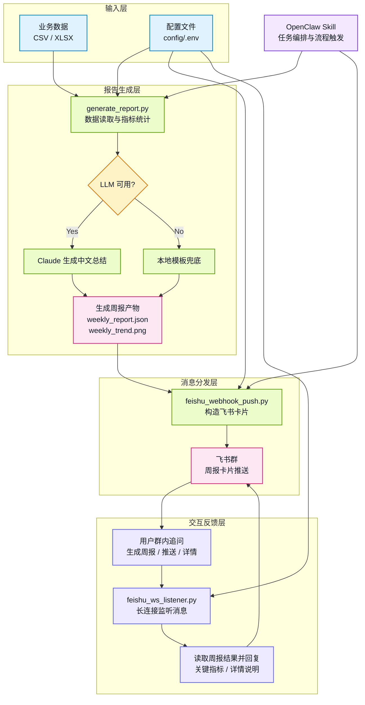

<div align="center">

# OpenClaw Feishu Report Bot

**面向自动化办公场景的 OpenClaw 智能体工作流示例**

从业务数据自动生成经营周报、趋势图和大模型总结，并通过飞书群机器人推送，同时支持群内追问详情。

[](#快速开始)
[](#openclaw-skill)
[](#docker-部署)
[](LICENSE)
[](docs/WORKFLOW.md)

</div>

---

## 项目定位

`openclaw-feishu-report-bot` 是一个开箱即用的自动化办公 Agent 工作流项目。

它把常见办公流程中的 **数据处理 → 指标统计 → LLM 总结 → 图表生成 → 飞书推送 → 群内追问 → 安全部署** 串成一条完整链路，适合用于：

- 自动化办公智能体演示
- 企业 IM 工作流集成样例
- OpenClaw Skill 开发参考
- 飞书 Webhook / WebSocket 长连接联调参考
- 小型业务周报机器人原型

项目内置示例数据和完整配置模板，支持先本地运行最小 Demo，再按部署文档接入真实飞书群和 OpenClaw 环境。

---

## 核心能力

<table>
<tr>
<td width="50%">

### 业务自动化

- 读取 CSV / XLSX 业务数据
- 计算营收、订单、客单价、环比等指标
- 自动生成中文周报总结
- 生成营收趋势图
- 输出结构化 `weekly_report.json`

</td>
<td width="50%">

### 智能体工作流

- OpenClaw Skill 触发任务
- 飞书 Webhook 推送周报卡片
- 飞书 WebSocket 接收群内消息
- 支持“生成周报 / 推送 / 详情”指令
- Docker 沙箱与本地端口绑定

</td>
</tr>
</table>

---

## 工作流总览



---

## 系统结构

```text
openclaw-feishu-report-bot/
├── README.md                         # 项目首页
├── QUICKSTART.md                     # 5 分钟最小跑通
├── CHANGELOG.md                      # 版本记录
├── LICENSE                           # MIT 协议
├── requirements.txt                  # Python 依赖
├── scripts/                          # 核心脚本
│   ├── common_env.py                 # 统一读取 config/.env
│   ├── generate_report.py            # 数据统计 + 总结 + 图表
│   ├── feishu_webhook_push.py        # 飞书 Webhook 推送
│   ├── feishu_ws_listener.py         # 飞书 WebSocket 监听
│   └── health_check.py               # 部署自检
├── skills/weekly-report/SKILL.md     # OpenClaw Skill 定义
├── docker/                           # Docker 沙箱部署
├── config/                           # 示例配置，不放真实密钥
├── sample_data/                      # 示例数据
├── output/                           # 运行产物目录
├── docs/                             # 部署、验收、排障、流程文档
└── .github/                          # CI、Issue、PR 模板
```

---

## 快速开始

无需任何飞书或大模型密钥，即可先跑通最小链路。

```bash
python -m venv .venv
source .venv/bin/activate
pip install -r requirements.txt

python scripts/health_check.py
python scripts/generate_report.py --input sample_data/sample_sales.csv
```

成功后会生成：

```text
output/weekly_report.json
output/weekly_trend.png
```

完整步骤见：[QUICKSTART.md](QUICKSTART.md)

---

## 配置飞书与大模型

复制配置模板：

```bash
cp config/.env.example config/.env
chmod 600 config/.env
```

填写以下变量：

```dotenv
ANTHROPIC_API_KEY=
FEISHU_APP_ID=
FEISHU_APP_SECRET=
FEISHU_WEBHOOK_URL=
FEISHU_WEBHOOK_SECRET=
```

然后执行完整链路：

```bash
python scripts/generate_report.py --input sample_data/sample_sales.csv
python scripts/feishu_webhook_push.py --report output/weekly_report.json
python scripts/feishu_ws_listener.py
```

---

## OpenClaw Skill

复制 Skill：

```bash
cp -r skills/weekly-report ~/.openclaw/workspace/skills/
```

在 OpenClaw 中输入：

```text
生成本周销售周报并发到飞书群
```

预期调度链路：

```text
匹配 weekly-report Skill
→ 运行 generate_report.py
→ 检查 output/weekly_report.json
→ 运行 feishu_webhook_push.py
→ 返回推送结果
```

更多运行记录格式见：[docs/OPENCLAW_RUN_LOG.md](docs/OPENCLAW_RUN_LOG.md)

---

## Docker 部署

```bash
cp config/.env.example config/.env
# 填写 config/.env 后：
cd docker
docker compose up -d
docker compose logs -f openclaw
```

默认端口绑定：

```text
127.0.0.1:18789
```

不要直接改成 `0.0.0.0` 暴露公网端口；远程维护建议使用 Tailscale 或等价内网方案。

---

## 文档导航

| 文档 | 说明 |
|---|---|
| [QUICKSTART.md](QUICKSTART.md) | 5 分钟跑通最小 Demo |
| [docs/WORKFLOW.md](docs/WORKFLOW.md) | 业务流程与智能体工作流 |
| [docs/DEPLOYMENT.md](docs/DEPLOYMENT.md) | 正式部署步骤 |
| [docs/ACCEPTANCE.md](docs/ACCEPTANCE.md) | 项目验收清单 |
| [docs/TROUBLESHOOTING.md](docs/TROUBLESHOOTING.md) | 常见错误处理 |
| [docs/TEST_EVIDENCE.md](docs/TEST_EVIDENCE.md) | 测试记录 |
| [docs/OPENCLAW_RUN_LOG.md](docs/OPENCLAW_RUN_LOG.md) | OpenClaw 运行记录模板 |
| [CONTRIBUTING.md](CONTRIBUTING.md) | 贡献指南 |
| [SECURITY.md](SECURITY.md) | 安全说明 |

---

## 安全原则

- 不提交 `config/.env`。
- 不提交真实飞书群 ID、Webhook URL、App Secret、Tenant Token 或 LLM API Key。
- 不提交客户业务数据。
- 不把 Docker 端口直接暴露到公网。
- 公开仓库只保留示例数据和示例配置。

---

## Roadmap

- [ ] 增加更多业务报表模板
- [ ] 支持更多图表类型
- [ ] 支持自定义飞书卡片主题
- [ ] 增加单元测试覆盖
- [ ] 增加多租户/多群配置示例
- [ ] 增加更多 OpenClaw Skill 工作流示例

---

## License

MIT License. See [LICENSE](LICENSE).
