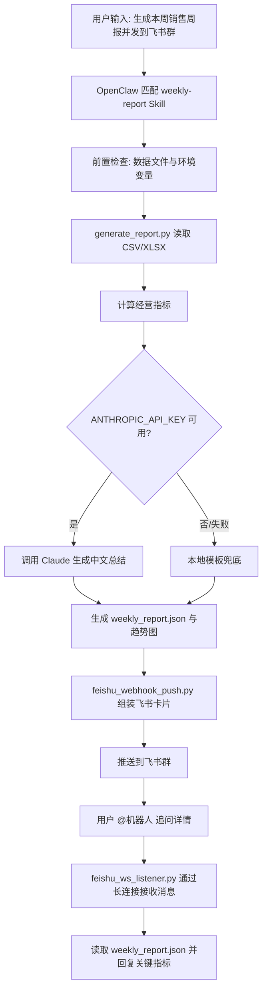

# OpenClaw Feishu Report Bot

面向自动化办公场景的智能体工作流示例：读取 CSV/XLSX 业务数据，自动生成经营周报、趋势图和大模型总结，并通过飞书群机器人推送，同时支持群内追问详情。

> 当前版本：`0.2.0`。本仓库已完成代码结构整理、配置隔离、健康检查、Docker 部署文件和验收文档。真实飞书收发与 OpenClaw 调度需要在配置好凭证的真机环境完成验收。

## 功能概览

| 能力 | 说明 |
|---|---|
| 数据读取 | 支持 CSV/XLSX，示例字段为 `date`、`revenue`、`orders` |
| 周报统计 | 计算总营收、订单数、客单价、最佳/最弱单日、环比增长 |
| 大模型总结 | 优先调用 Claude；无 Key 或调用失败时自动降级为本地模板 |
| 趋势图生成 | 使用 Matplotlib 生成营收趋势图 |
| 飞书推送 | 使用飞书自定义机器人 Webhook 推送卡片 |
| 群内追问 | 使用飞书 WebSocket 长连接接收群消息，不需要公网回调 URL |
| Agent 调度 | 使用 OpenClaw Skill 将“生成周报 → 检查产物 → 推送飞书”串成工作流 |
| 安全部署 | `.env` 隔离密钥，Docker 只绑定 `127.0.0.1`，可配合 Tailscale 远程维护 |

## 工作流



## 目录结构

```text
openclaw-feishu-report-bot/
├── README.md
├── QUICKSTART.md
├── CHANGELOG.md
├── LICENSE
├── requirements.txt
├── .gitignore
├── scripts/
│   ├── common_env.py
│   ├── generate_report.py
│   ├── feishu_webhook_push.py
│   ├── feishu_ws_listener.py
│   └── health_check.py
├── docker/
│   ├── Dockerfile
│   └── docker-compose.yml
├── config/
│   ├── .env.example
│   └── openclaw.json.example
├── skills/
│   └── weekly-report/
│       └── SKILL.md
├── sample_data/
│   └── sample_sales.csv
├── output/
│   └── .gitkeep
├── docs/
│   ├── WORKFLOW.md
│   ├── DEPLOYMENT.md
│   ├── ACCEPTANCE.md
│   ├── TROUBLESHOOTING.md
│   ├── TEST_EVIDENCE.md
│   └── OPENCLAW_RUN_LOG.md
└── .github/
    ├── workflows/ci.yml
    ├── ISSUE_TEMPLATE/
    └── PULL_REQUEST_TEMPLATE.md
```

## 快速开始

无需任何密钥即可跑通最小链路：

```bash
python -m venv .venv
source .venv/bin/activate
pip install -r requirements.txt

python scripts/health_check.py
python scripts/generate_report.py --input sample_data/sample_sales.csv
```

预期生成：

```text
output/weekly_report.json
output/weekly_trend.png
```

完整步骤见 [QUICKSTART.md](QUICKSTART.md)。

## 配置飞书与大模型

复制示例配置：

```bash
cp config/.env.example config/.env
chmod 600 config/.env
```

填写：

```dotenv
ANTHROPIC_API_KEY=
FEISHU_APP_ID=
FEISHU_APP_SECRET=
FEISHU_WEBHOOK_URL=
FEISHU_WEBHOOK_SECRET=
```

然后执行：

```bash
python scripts/generate_report.py --input sample_data/sample_sales.csv
python scripts/feishu_webhook_push.py --report output/weekly_report.json
python scripts/feishu_ws_listener.py
```

## OpenClaw Skill

将 Skill 复制到 OpenClaw workspace：

```bash
cp -r skills/weekly-report ~/.openclaw/workspace/skills/
```

在 OpenClaw 中输入：

```text
生成本周销售周报并发到飞书群
```

期望执行链路：

```text
匹配 weekly-report Skill
→ 运行 generate_report.py
→ 检查 output/weekly_report.json
→ 运行 feishu_webhook_push.py
→ 返回推送结果
```

真实运行日志请按 [docs/OPENCLAW_RUN_LOG.md](docs/OPENCLAW_RUN_LOG.md) 填写。

## Docker 部署

```bash
cp config/.env.example config/.env
# 填写 config/.env 后：
cd docker
docker compose up -d
docker compose logs -f openclaw
```

默认只绑定：

```text
127.0.0.1:18789
```

不要直接改为 `0.0.0.0` 暴露公网端口；远程维护建议走 Tailscale 或等价内网方案。

## 文档索引

| 文档 | 用途 |
|---|---|
| [QUICKSTART.md](QUICKSTART.md) | 5 分钟跑通最小 Demo |
| [docs/WORKFLOW.md](docs/WORKFLOW.md) | 完整业务流程与智能体工作流说明 |
| [docs/DEPLOYMENT.md](docs/DEPLOYMENT.md) | 正式部署步骤 |
| [docs/ACCEPTANCE.md](docs/ACCEPTANCE.md) | 验收标准 |
| [docs/TROUBLESHOOTING.md](docs/TROUBLESHOOTING.md) | 常见错误处理 |
| [docs/TEST_EVIDENCE.md](docs/TEST_EVIDENCE.md) | 已验证内容与待真机验证项 |
| [docs/OPENCLAW_RUN_LOG.md](docs/OPENCLAW_RUN_LOG.md) | OpenClaw 调度日志模板 |
| [CONTRIBUTING.md](CONTRIBUTING.md) | 贡献指南 |
| [SECURITY.md](SECURITY.md) | 安全说明 |

## 当前验证状态

| 验证项 | 状态 |
|---|---|
| 周报生成主链路 | 已验证 |
| API 失败后本地模板降级 | 已验证 |
| 错误退出码 | 已验证 |
| 健康检查 | 已验证 |
| 飞书 Webhook 真实推送 | 待真机验证 |
| 飞书 WebSocket 群内追问 | 待真机验证 |
| OpenClaw 自动调度 | 待真机验证 |
| Docker 真机启动 | 待真机验证 |

## 安全说明

- 不提交 `config/.env`。
- 不提交真实飞书群 ID、Webhook URL、App Secret、Tenant Token 或 LLM API Key。
- 不提交客户业务数据。
- 不把 Docker 端口直接暴露到公网。
- 公开仓库只保留示例数据和示例配置。

## License

MIT License. See [LICENSE](LICENSE).
